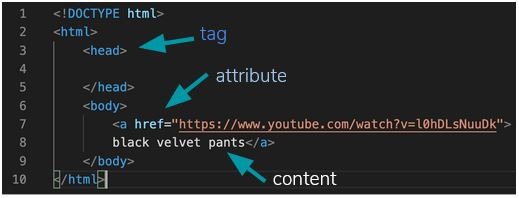

### Introduction

Lets review some vocabulary

## HTML

HTML - Html stands for Hypertext Markup Language.
Hypertext means the ability to make hyperlinks to web content.
We use HTML to markup content: to tell the browser about headings paragraphs images and more ie HTML is used to add content to your web page: text, images, links and videos

## HTML Tags

HTML tags help browsers understand your content
Html tags go in angle brackets `< >` or square bananas :-)

Many HTML tags sorround content.

`<p>Hello there! I am a paragraph?</p>`

Some HTMl tags sorround other tags!

`<p>For more information, check out <a href="pagetwo.html">page two</a></p>`

some HTML tags stand alone

``

> **Note:** no `</img>` is necessary

Some HTML tags need attributes to provide more information


> **Note:** We close the tag and not the attribute

## What HTML tags are on every web page?

`<!doctype html>` - Tells the browser this is an HTML document.
`<html></html>` - Tells browser where your HTML begins and ends.
`<head></head>` - Information for the browser about your page.
`<body></body>` - The contents of your page go here.

> **Note:** Without these tags the browser cannot identify your HTML page
> **Note:** Below is the complete structure of a HTML Web page

---

Example

```
<!doctype html>
<html>
    <head>
    </head>
    <body>
    </body>
</html>
```

## Code Editiors

code editors make writing HTML easier

- [Atom](https://atom.io/)
- [Sublime text ](https://www.sublimetext.com/)
- [VS Code](https://code.visualstudio.com/)

> **Note:** I use VS Code

Code editors offer both tag completion


and code coloring



### Learning Outcomes

- How is an HTML5 document structured?
- What are elements/tags?
- What are element attributes

### Assignment

<div class="lesson-content__panel" markdown="1">
- Read [Shay Howe's Introduction to Terminology & Syntax](http://learn.shayhowe.com/html-css/terminology-syntax-intro)
- Read [Shay Howe on the HTML Basics](http://learn.shayhowe.com/html-css/elements-semantics)
- Read [Shay Howe on Best Practices](http://learn.shayhowe.com/html-css/coding-practices)
</div>

### Additional Resources

This section contains helpful links to other content. It isn't required, so consider it supplemental for if you need to dive deeper into something.

- [WTFHTMLCSS with basic tips to improve your code](http://wtfhtmlcss.com/)
- [W3C HTML5 tutorial ](http://www.w3schools.com/html/default.asp)
- [HTML Style Guide](http://codeguide.co/#html) by [Mark Otto](https://github.com/mdo), one of the creators of Bootstrap.
- [CrashCourse Introduction to HTML&CSS](https://www.youtube.com/watch?v=QA0XpGhiz5w)
